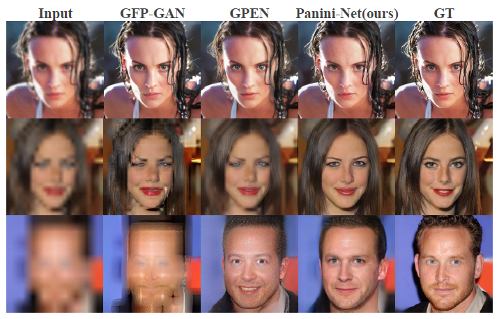
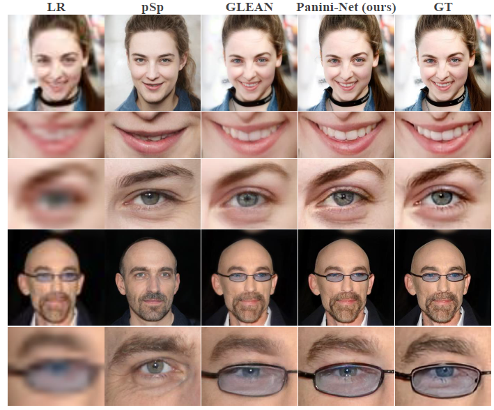
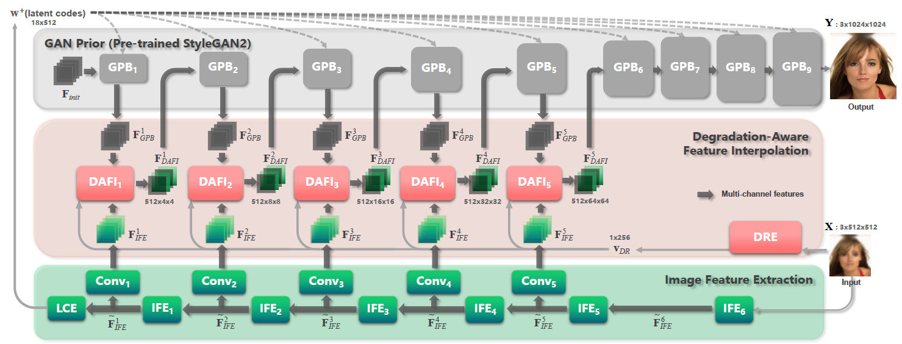

# Panini-Net: GAN Prior based Degradation-Aware Feature Interpolation for Face Restoration

This repository is for Panini-Net introduced in the following paper

Yinhuai Wang, Yujie Hu, [Jian Zhang](http://jianzhang.tech/), "Panini-Net: GAN Prior based Degradation-Aware Feature Interpolation for Face Restoration", AAAI 2022, [[arxiv]](https://arxiv.org/pdf/2203.08444.pdf)


#### Face Restoration


#### Face Super-Resolution


## Introduction

Emerging high-quality face restoration (FR) methods often utilize pre-trained GAN models (i.e., StyleGAN2) as GAN Prior. However, these methods usually struggle to balance realness and fidelity when facing various degradation levels. Besides, there is still a noticeable visual quality gap compared with pre-trained GAN models. In this paper, we propose a novel GAN Prior based degradation-aware feature interpolation network, dubbed Panini-Net, for FR tasks by explicitly learning the abstract representations to distinguish various degradations. Specifically, an unsupervised degradation representation learning (UDRL) strategy is first developed to extract degradation representations (DR) of the input degraded images. Then, a degradation-aware feature interpolation (DAFI) module is proposed to dynamically fuse the two types of informative features (i.e., features from input images and features from GAN Prior) with flexible adaption to various degradations based on DR. Ablation studies reveal the working mechanism of DAFI and its potential for editable FR. Extensive experiments demonstrate that our Panini-Net achieves state-of-the-art performance for multi-degradation face restoration and face super-resolution.



**Figure:** *Overview of Panini-Net*

## Installation

Clone this repository:

```bash
git clone https://github.com/jianzhangcs/panini.git
cd panini
```

This code is based on MMEditing. Please refer to [install.md](https://github.com/open-mmlab/mmediting/blob/master/docs/en/install.rst) to install dependencies.

## Dataset

This code uses [FFHQ](https://github.com/NVlabs/ffhq-dataset) for training and [CelebA-HQ](https://github.com/tkarras/progressive_growing_of_gans) for testing.

After downloading and degenerating the datasets, we put the datasets into `data/`

## Test Using Pretrained Models

Download our pre-trained model ([moco](https://drive.google.com/file/d/1VqFRXJGlDcn1zbT0eT7tAuclh6tgvvHA/view?usp=sharing), [panini_mfr](https://drive.google.com/file/d/1iwiWoAxNTyp3NKHQfCj0FCEX9uwX27CQ/view?usp=sharing), [panini_16xsr](https://drive.google.com/file/d/1ewSBfxXJmDMioGx95lLvD95l8lhgPaGU/view?usp=sharing)) and put them into `checkpoint/`

You can use scripts in file `test_script.sh` to test.

#### Test a single image

```bash
python demo/restoration_single_face_demo.py --config configs/panini_mfr.py --checkpoint checkpoint/panini_mfr_latest.pth --img_path examples/MFR/00001.png --save_path examples/MFR_result/00001.png

python demo/restoration_single_face_demo.py --config configs/panini_sr.py --checkpoint checkpoint/panini_sr_latest.pth --img_path examples/SR/00001.png --save_path examples/SR_result/00001.png
```

#### Test a directory with images

```bash
python demo/restoration_dir_face_demo.py --config configs/panini_mfr.py --checkpoint checkpoint/panini_mfr_latest.pth --img_path examples/MFR --save_path examples/MFR_result

python demo/restoration_dir_face_demo.py --config configs/panini_sr.py --checkpoint my_project/panini_sr/latest.pth --img_path examples/SR --save_path examples/SR_result
```

## Train Moco

You can use scripts in file 'moco/train.sh' to train.

```bash
python main_moco.py --lr 0.03 --batch-size 32 --dist-url 'tcp://localhost:10001' --multiprocessing-distributed --world-size 1 --rank 0 --epochs 200
```

## Train Panini-Net

You can use scripts in file `train_script.sh` to train/test.

#### Train with a single GPU

```bash
python tools/train.py configs/panini_mfr.py --work-dir my_project/panini_mfr

python tools/train.py configs/panini_sr.py --work-dir my_project/panini_sr
```

#### Resume from a previous checkpoint file

```bash
python tools/train.py configs/panini_mfr.py --work-dir my_project/panini_mfr --resume-from my_project/panini_mfr/latest.pth

python tools/train.py configs/panini_sr.py --work-dir my_project/panini_sr --resume-from my_project/panini_sr/latest.pth
```

#### Train with multiple GPUs

```bash
python -m torch.distributed.launch --nproc_per_node=2 tools/train.py configs/panini_mfr.py --work-dir my_project/panini_mfr

python -m torch.distributed.launch --nproc_per_node=2 tools/train.py configs/panini_sr.py --work-dir my_project/panini_sr
```


## Citation

If our work is useful for your research, please consider citing:

```
@inproceedings{wang2022panini,
	title={Panini-Net: GAN Prior Based Degradation-Aware Feature Interpolation for Face Restoration},
	author={Wang, Yinhuai and Hu, Yujie and Zhang, Jian},
	booktitle={Proceedings of the AAAI Conference on Artificial Intelligence (AAAI)},
	year={2022}
}
```

## Acknowledgments

This code borrows heavily from [MMEditing](https://github.com/open-mmlab/mmediting).
